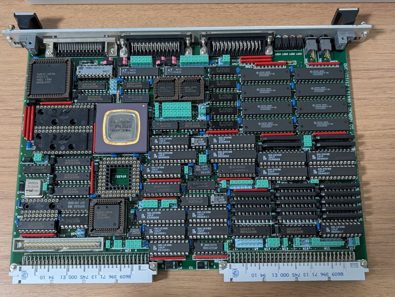

# VMEbus-V53

This repository contains documentation and sources for running DENSAN's V53 VME board DVE-V53/12.

Please refer to my blog for more information.  
https://kanpapa.com/2026/01/v53-vme-system-1.html

* Hardware test programs
  * [hello_world](hello_world)
    * A program to continuously send a single character to the serial port.
  * [echo_back](echo_back)
    * A program to perform a serial port echoback test.
  * [ram_test](ram_test)
    * A generic memory test program.

* Monitor program
  * [monitor](monitor)
    * Monitor program for the V53 CPU.

* [images](images)
  * Board photos and images.

## Disclaimer
The contents of this repository are the result of personal research and are provided "as is" without any warranty.
